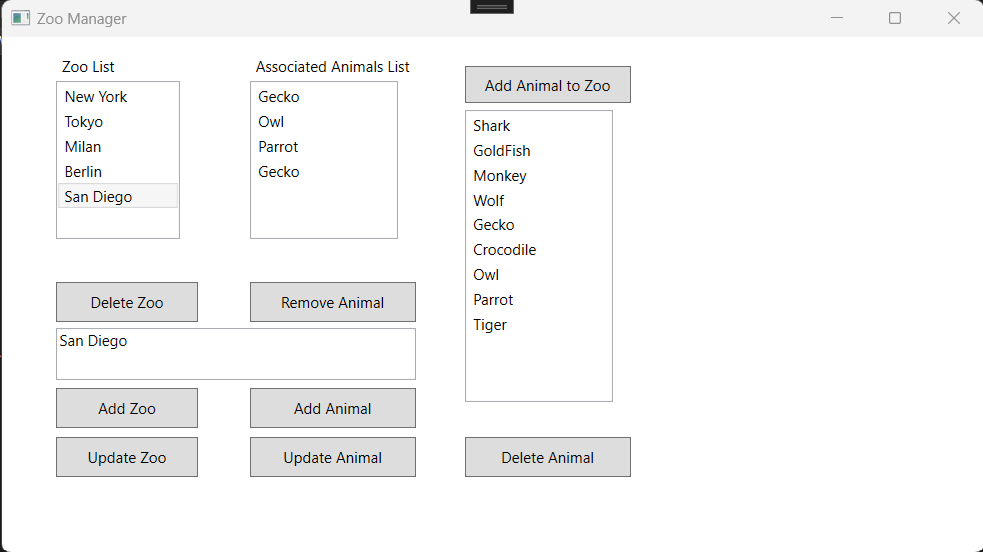

# ZooManager-WPF-DB 

  ## Description

  A Zoo Manager application built with C# using the WPF framework and SQL Server.  Add new locations for zoos, add new animals and associate specific animals to specific zoo locations.
  Supports all CRUD operations - creating new zoo locations & new animals, associating animals with zoos, deleting locations and animals, and updating zoo location & animal names.  

  ### App Screenshot
  
  
  ## Table of Contents
  
  - [Installation](#installation)
  - [Usage](#usage)
  - [License](#license)
  - [Contributing](#contributing)
  - [Tests](#tests)
  - [Questions](#questions)
  
  ## Installation
  
  Download and run code in Visual Studio
  
  ## Usage
  
  Use the user interface to add new zoo locations, add new animals, add animals to zoo locations, delete & updating locations, animals.

  ## License
This application is covered under the MIT License.
 For more information: https://opensource.org/licenses/MIT
  
  ## Contributing
  N/A
  
  ## Tests
  N/A

  ## Questions
  Contact Info 
  GitHub user name: BillStephens2022 
  Link to GitHub profile: https://github.com/BillStephens2022 
  Email: stephensbill17@gmail.com
